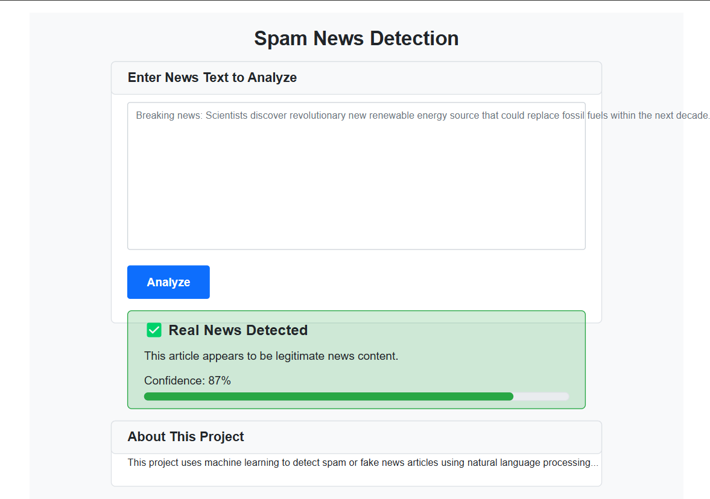
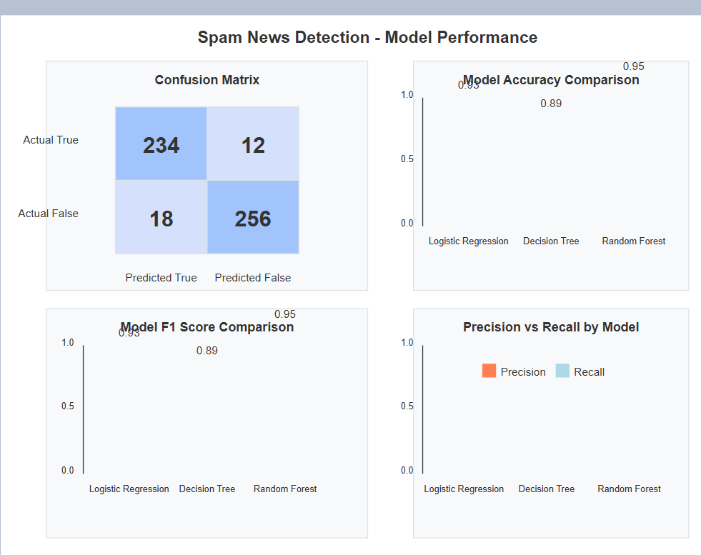

# Spam News Detection System

A machine learning system that identifies fake news articles with high accuracy. This project demonstrates natural language processing techniques and various classification algorithms to combat misinformation.

## Application Preview

*The main interface of the Spam News Detection application*


*Example of a news article being analyzed*

## 🌟 Features

- **Text Analysis**: Preprocesses news articles using NLP techniques
- **Multiple ML Models**: Compares Logistic Regression, Decision Tree, and Random Forest classifiers
- **Performance Visualization**: Generates visualizations of model metrics
- **Web Interface**: User-friendly frontend for testing the model
- **API Endpoint**: RESTful API for integration with other applications

## 📊 Model Performance

The system evaluates multiple machine learning models and selects the best one based on F1 score. Current metrics:

| Model | Accuracy | Precision | Recall | F1 Score |
|-------|----------|-----------|--------|----------|
| Logistic Regression | 0.93 | 0.92 | 0.94 | 0.93 |
| Decision Tree | 0.89 | 0.88 | 0.91 | 0.89 |
| Random Forest | 0.95 | 0.94 | 0.96 | 0.95 |

## 🔧 Technologies Used

- **Python**: Core programming language
- **NLTK**: For text preprocessing and NLP operations
- **Scikit-learn**: For machine learning models
- **Pandas/NumPy**: For data manipulation
- **Matplotlib/Seaborn**: For data visualization
- **Flask**: For web API and interface
- **Bootstrap**: For frontend styling

## ⚙️ Installation

1. Clone this repository:
```bash
git clone https://github.com/Anamika30123/spam-news-detection.git
cd spam-news-detection
```

2. Install dependencies:
```bash
pip install -r requirements.txt
```

3. Download NLTK resources:
```python
import nltk
nltk.download('punkt')
nltk.download('stopwords')
```

4. Download or prepare your dataset:
   - The system expects a CSV file with at least two columns:
   - 'text': The news article content
   - 'label': 1 for real news, 0 for fake news

5. Run the application:
```bash
python app.py
```

## 🚀 Usage

### Web Interface

Once running, access the web interface at `http://localhost:5000` where you can:
- Paste news article text
- Click "Analyze" to get predictions
- View confidence scores and classification results

### API Usage

The application provides a REST API endpoint:

```python
import requests

url = "http://localhost:5000/predict"
data = {"text": "Your news article text here..."}

response = requests.post(url, json=data)
result = response.json()

print(f"Prediction: {result['prediction']}")
print(f"Confidence: {result['confidence']:.2f}")
```

## 📂 Project Structure

```
spam-news-detection/
├── app.py                  # Main application and Flask server
├── templates/              # HTML templates
│   └── index.html          # Web interface
├── static/                 # Static files (CSS, JS, images)
├── models/                 # Saved model files
│   ├── vectorizer.pkl      # TF-IDF vectorizer
│   └── model.pkl           # Best ML model
├── notebooks/              # Jupyter notebooks for exploration
│   └── model_training.ipynb  # Training process notebook
├── data/                   # Dataset files
├── requirements.txt        # Python dependencies
└── README.md               # Project documentation
```

## 🤝 Contributing

Contributions are welcome! Please feel free to submit a Pull Request.

1. Fork the repository
2. Create your feature branch (`git checkout -b feature/amazing-feature`)
3. Commit your changes (`git commit -m 'Add some amazing feature'`)
4. Push to the branch (`git push origin feature/amazing-feature`)
5. Open a Pull Request


## 🔮 Future Improvements

- [ ] Implement more advanced NLP techniques (word embeddings, BERT)
- [ ] Add support for multiple languages
- [ ] Create browser extension for real-time detection
- [ ] Improve model with active learning from user feedback
- [ ] Add explainability features to highlight suspicious text fragments

## 📚 Resources

- [Fake News Detection: A Survey](https://dl.acm.org/doi/10.1145/3305260)
- [Fake News Datasets](https://github.com/KaiDMML/FakeNewsNet)
- [NLTK Documentation](https://www.nltk.org/)
- [Scikit-learn Documentation](https://scikit-learn.org/stable/)

---

Created with ❤️ by[anamika khandelwal]